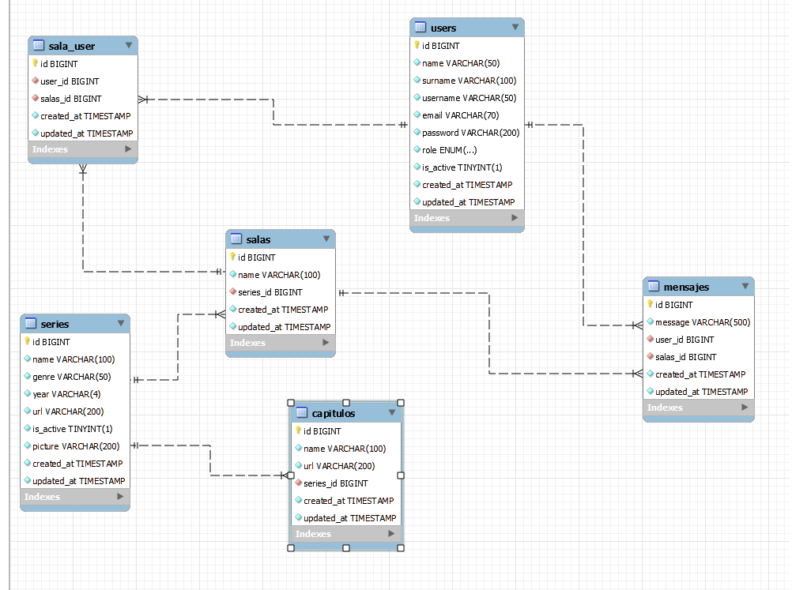

# Proyecto Final

## Servicio de series

La plataforma de series es una aplicación web diseñada para facilitar el acceso a series de los años 80 y 90. Dirigida a usuarios que desean recordar una infancia o volver a ver las series que seguramente veiamos de pequeños, la plataforma ofrece una sala de chat donde los usuarios pueden compartir opiniones sobre las series que están viendo o simplemente charlar con gente que comparte tus mismos gustos y así no tener nunca la sensación de estar viendo las series tú solo, aunque nadie las esté viendo contigo en ese momento.

## Tecnologias utilizadas

- Visual Studio Code
- PHP
- Laravel
- Mysql

## Tablas

## Instalacion en local
 
 1. Clonamos el repositorio con el comando "$ git clone [URL del repositorio]"

 2. Instalamos dependencias con el comando "$ npm install"

 3. Conectamos nuestro repositorio con nuestra base de datos, copiamos los datos del archivo ".env.example" y creamos un archivo llamado ".env" con esos mismos datos pero modificando los valores con las credenciales de nuestra base de datos.

 4. Ejecutamos las migraciones con el comando "$ npx typeorm-ts-node-commonjs migration:run -d ./src/database.ts"

5. Ejecutamos el comando "$ npm run start" para poner en marcha nuestro servidor y nuestra base de datos.

## Endpoints

 Endpoints 

- REGISTER

        POST localhost:8000/api/register

        body:
            {
  "name": "Chicho",
  "surname": "Terremoto",
  "username": "Chicho",
  "email": "chicho@gmail.com",
  "password": "Password1."
}

- LOGIN

    POST localhost:8000/api/login

    body:
        {
  "username": "chichonicle",
  "password": "Password1."
}

- PROFILE

    GET localhost:8000/api/profile
    
   

- LOGOUT
    POST localhost:8000/api/logout

- UPDATE USER

    PUT localhost:8000/api/update

    body:
        {
  "name": "david",
  "surname": "Ochando",
  "username": "David86",
  "email": "david@gmail.com",
  "password": "Password1."
}

- GET SERIES

    GET localhost:8000/api/series

- GET SERIE BY ID

    GET localhost:8000/api/serie/1

- CREATE MESSAGE

    POST localhost:8000/api/createMessage

    body:
    {
  "salas_id":"1",
  "message": "Hola a todos"
}

    GET localhost:8000/api/serie/1

- GET MESSAGES

    GET localhost:8000/api/messages

- GET MESSAGE BY ID

    GET localhost:8000/api/message

    body:
    {
  "salas_id": "1"
}

- UPDATE MESSAGE

    PUT localhost:8000/api/updateMessage/2

    body:
    {
  "message":"Mensaje actualizado"
}

- CREATE SERIE

    POST localhost:8000/api/serie

    body:
    {
  "name": "Dragones y Mazmorras",
  "year": "1986",
  "genre": "Aventuras",
  "url": "asdad",
  "picture": "asdasd"
}
(Only admin)

- DELETE SERIE

    DELETE localhost:8000/api/serie/3

    (Only admin)

- GET SALA

    GET localhost:8000/api/salas

- GET ALL USERS

    GET localhost:8000/api/users

    (Only admin)

- GET SALA MEMBER

    GET localhost:8000/api/sala/member/1/1

- CREATE SALA

    POST localhost:8000/api/sala

    body:
    {
  "name":"Dragon Ball",
  "series_id":"1"
}

- GET SALA BY ID

    GET localhost:8000/api/sala/1

- GET SALA-USER

    GET localhost:8000/api/sala-user

- GET MESSAGES OF SALA

    GET localhost:8000/api/messagesala

    body:
    {
  "salas_id": 1
}

- DELETE USER BY ID

    DELETE localhost:8000/api/users/2

    (Only admin)

   
- DELETE MESSAGE BY ADMIN

    DELETE localhost:8000/api/adminMessage/3

    (Only admin)

- DELETE MESSAGE BY ID

    DELETE localhost:8000/api/deleteMessage/13

## Contacto

 

## Agradecimientos

Agradecimentos a Geeks Hubs Academy, a mis profesores David Ochando y Dani Tarazona por los conocimientos que he podido adquirir a lo largo de todo el bootcamp y que han hecho posible este proyecto.